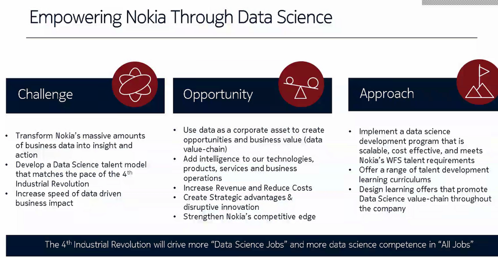
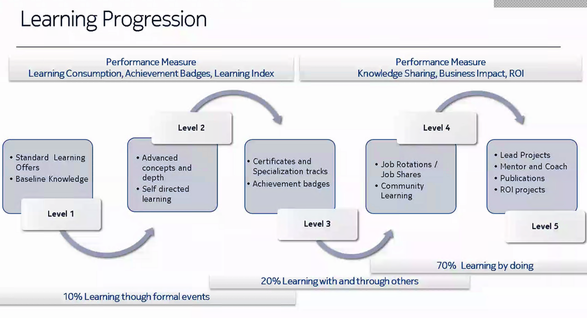
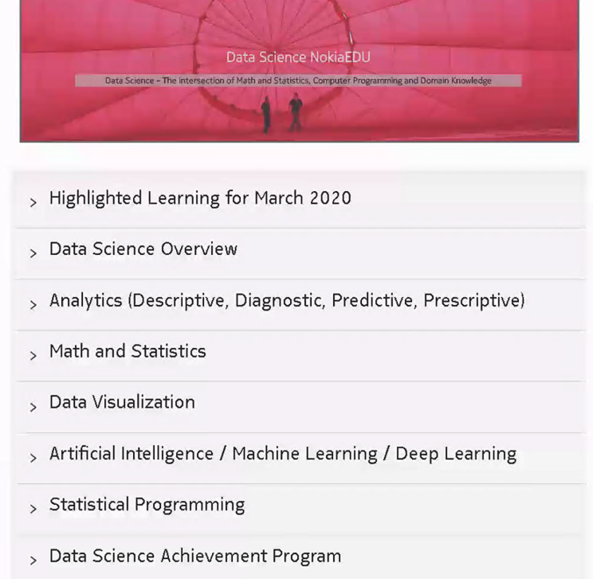
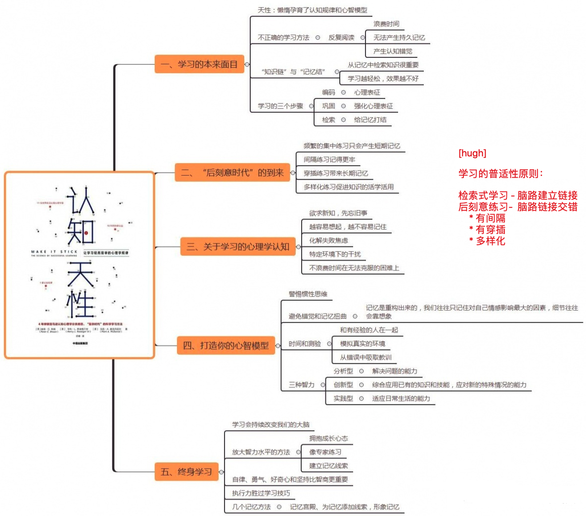
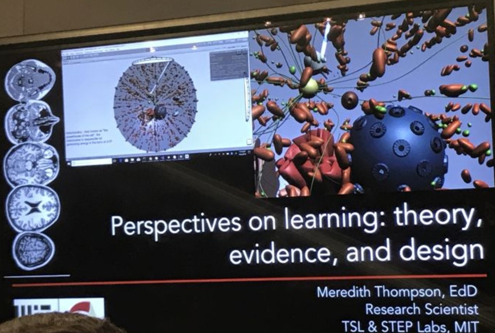
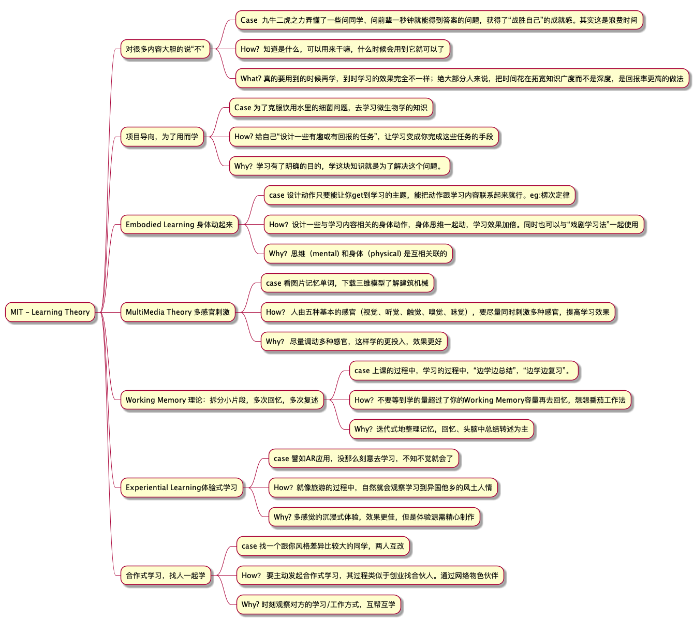

========================================
K.I.S.S.
========================================

GTD Overview
------------------

**GTD Tool**

`Doit.im <https://i.doitim.com/home/>`_
`Toggl   <https://www.toggl.com/app>`_

`Topbook高效生活 <https://topbook.cc/overview>`_ 

**Record**

`mubu幕布 <https://mubu.com>`_
`为知笔记 <http://www.wiz.cn/login>`_
`oneNote <https://www.onenote.com/notebooks?session=8484ba90-9477-473c-99f4-b450f4e4f886>`_
`oneNoteGem <http://cn.onenotegem.com/>`_
`Xmind <https://www.xmind.net/share/alphajay/>`_

**Cloud**

`坚果云 <www.jianguoyun.com>`_
`微云   <https://www.weiyun.com/disk>`_
`百度云 <https://pan.baidu.com/disk/home?>`_

**Infos**

`邮箱 <https://mail.qq.com>`_

**阅读**

微信公众号

TODO
----------------------

`视频博客Vlog指南 <https://www.williamlong.info/archives/5610.html>`_

Project_Quant
------------------
Python
bigQuant
233Course

Project_AI/ML/DL
------------------

`【精】机器学习入门须知  <https://www.zhihu.com/market/training/1196097274760224768/section/1219213952137236480>`_

`【精】机器学习集训营（试学已购）  <https://aijiaoai.greedyai.com/home>`_

`Edu DataScience <https://learningstore.nokia.com/employee/item/n.1525386193723>`_

`Intro of AI/ML/DL <https://www.youtube.com/watch?v=w-8MTXT_N6A>`_

learningTech 学习力
------------------------
`超强的学习能力是怎样练就的？ <https://www.zhihu.com/question/35103080/answer/633990519>`_

