========================================
GTD Flow
========================================

GTD框架
--------

* 步骤

    「收集」「处理」「整理」「回顾」「执行」这五个步骤

    可能你没有察觉到 ，不过这确实就是我们习以为常的处理事情的方法

    同时每周做总结，这种「反馈-调节」的机制可以促进整个任务处理流程的良性循环

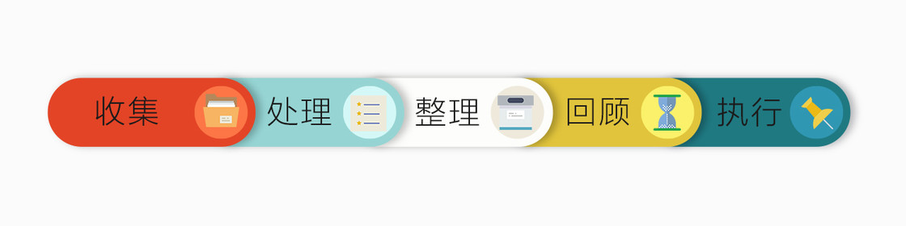

* 关键点理解

    纵观各种任务管理的工具：OmniFocus、Todoist、Things、org-mode ...

    其支持的概念有： Project、无限层级、Defer、Due、Repeat、Context、Label、Tag、Filter、Perspective 等等，

    它们支持的功能也各不相同，难道我们都要知道？每切换一种系统都需要再重新学习一遍？

* 个人理解

    GTD系统的核心部件是LTF：
    **列表/分类（List） 标签（Tag）  过滤（Filter）**

    GTD系统组成基本元素是：

    **任务Task  属性Attibute（List+Tag）  过滤器Filter（用List+Tag过滤）**

    list是特殊的tag，project是需要近期关注/内容复杂/用来分类的task

    执行的关键就是要在专注于当下适合做的事，这也是为什么要设置那么多过滤器的原因

* GTD心得

    **一切即tag + filter:**

    list/catogory都可以用tag实现， 而filter过滤则可以按照自己的意愿分配任务管理

    **一个app 一个目标：**

    大量的悲剧发生在对「目标」把握的失衡上,被效率工具所束缚是「舍本逐末」「负担」，别忘了使用他们的目标是为了「自由」

    生活中「喜欢 A，却和 B 交往，最后嫁给 C，出轨了 D」这种例子，数不胜数。

    **组合胜过单干：**

    1+1 >2， 尽可能让多个APP互相协调 / 组合, 譬如 IFTTT

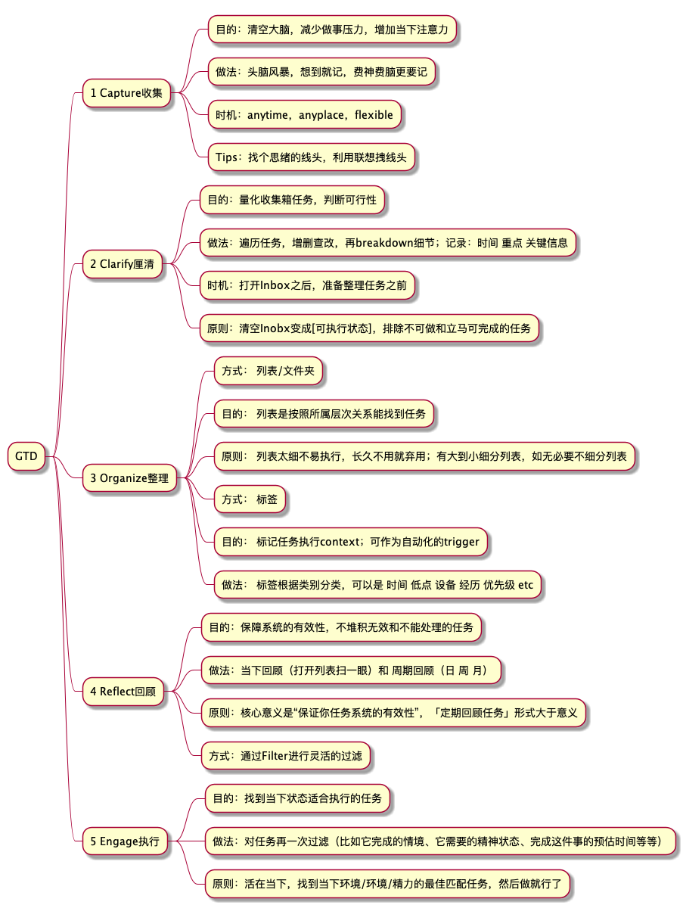

GTD参考
--------

.. image:: pic/200328_gtd.jpg

**我的标签分类**

=================  ======================================
Types of tag        Content
=================  ======================================
! Priority          Low
                    Medium
                    High
@ Context           AtHome  AtOffie    GoErrand
                    ByPhone ByComputer ByThinking
                    零碎时间 3Min
# Project           <ProjectList>
^ StartOn           Inbox
                    Today Tomorrow  Scheduled
                    Next   Waiting Someday
& Schedule          Today ThisWeek ThisMonth Recently
& Energy            ELow   EMedium   EHigh
& 4象限              紧急 重要
=================  ======================================

**我的Filter**

**常用标签分类**

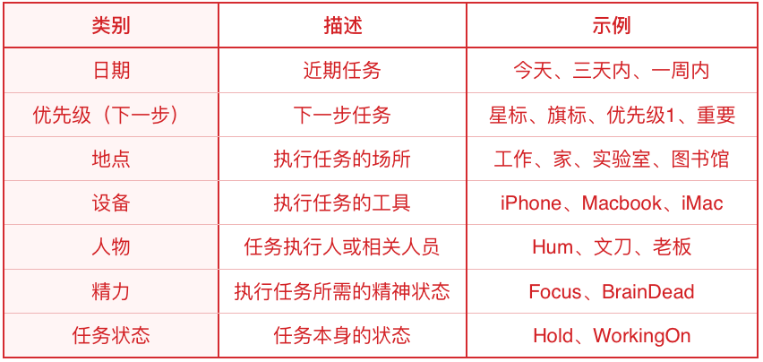

**常用Filter**

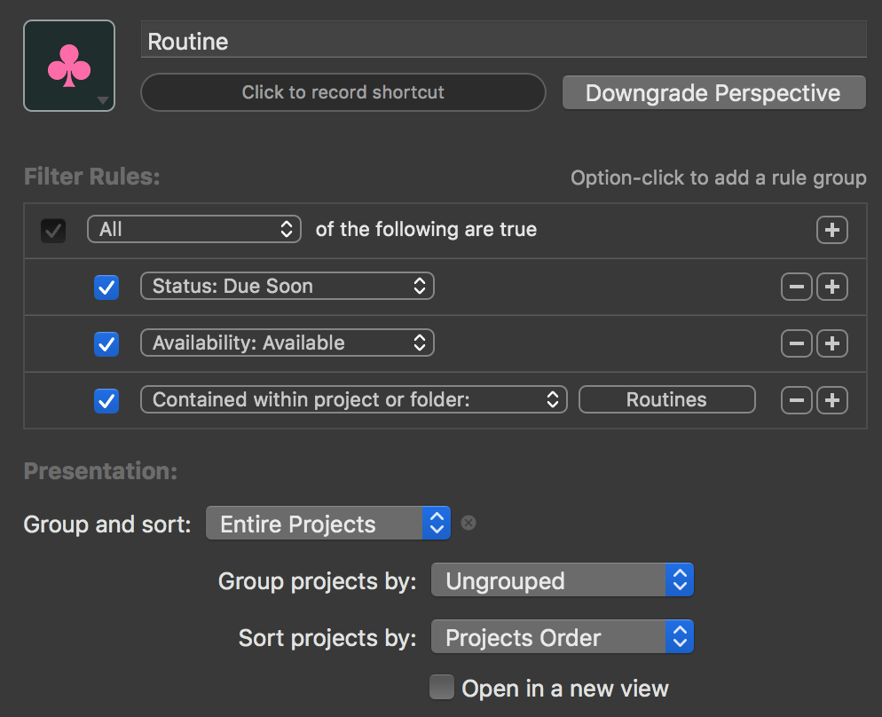

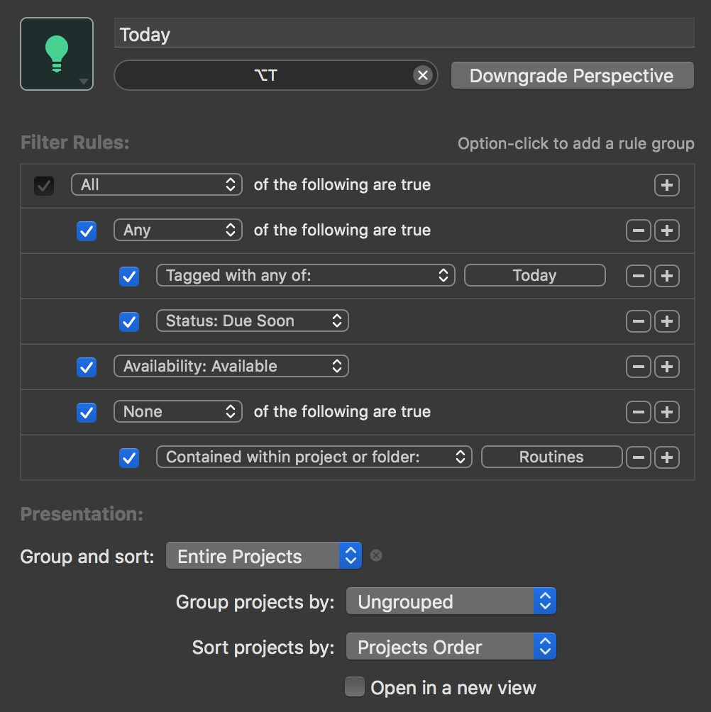

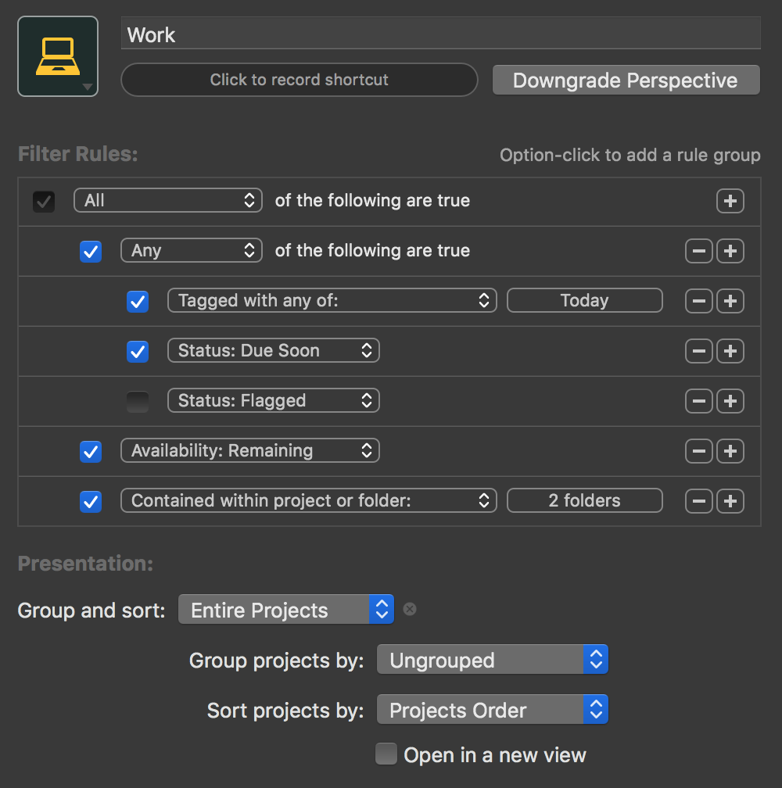

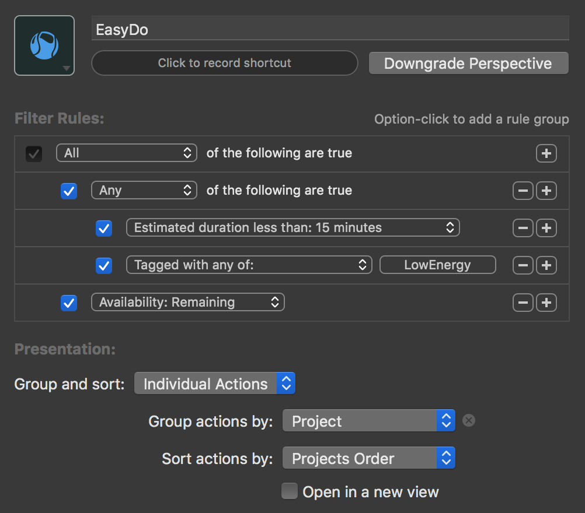

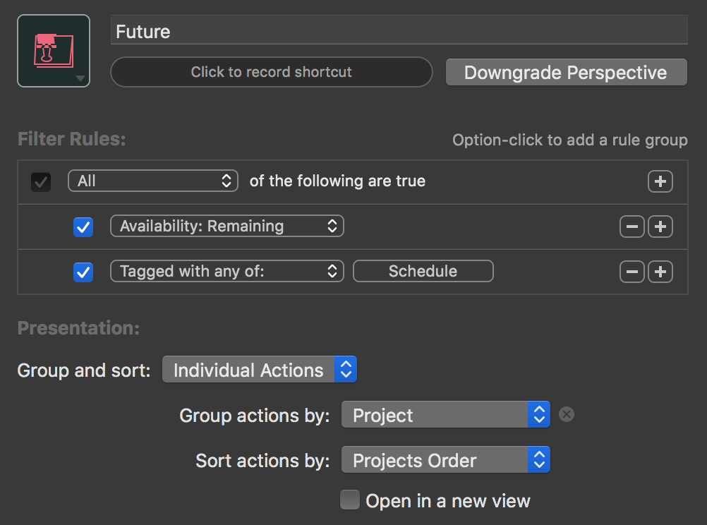

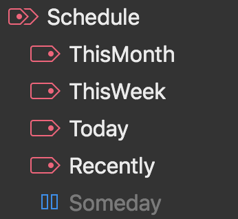

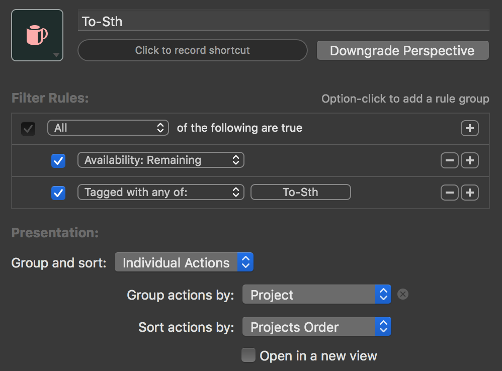

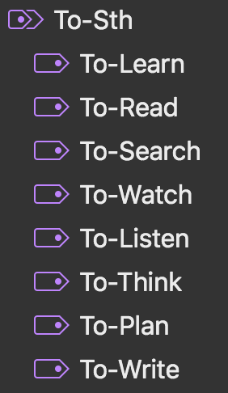

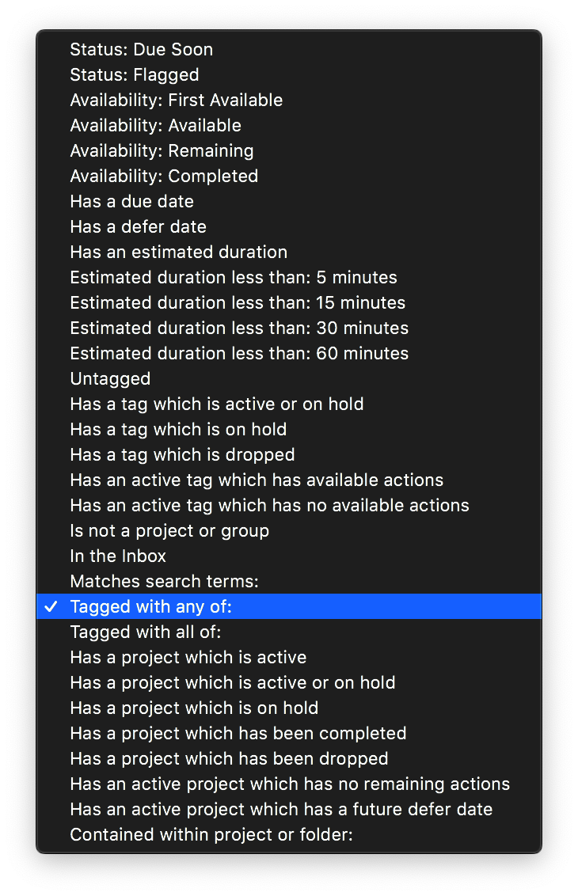

Link:

`[精]Topbook-科学地认识和使用GTD <https://zhuanlan.zhihu.com/p/90700594>`_

`GetThingDone，一套最系统、最全面的时间管理方法 <https://www.jianshu.com/p/cfc85e11028d>`_

`GTD with Todoist <https://get.todoist.help/hc/en-us/articles/203799792-Getting-Things-Done-GTD-with-Todoist>`_

`用更现代的方式做任务管理 <https://sspai.com/post/39996>`_

`视频讲解: todoist使用 <https://www.bilibili.com/video/av70161321/>`_

