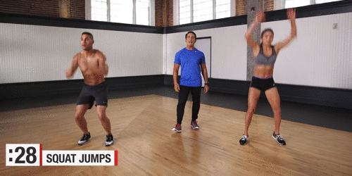

========================================
Gmy
========================================

**有氧vs无氧**
---------------

有氧会消耗脂肪和蛋白质，导致肌肉会越来越少，没有足量肌肉做支持，停止运动后容易反弹
无氧会消耗大部分糖分，可以塑形曲线和增加肌肉弹性，但是脂肪没有消耗，那么就会显胖显壮。
所以最好的运动方式其实是两者结合起来有主次地交叉运动

.. image:: pic/sports_200322_有氧无氧

**囚徒健身**
-------------

囚徒健身-六艺十式_

.. _囚徒健身-六艺十式: https://www.hiyd.com/qiutujianshen/

**HIIT CrossFit**
------------------
HIIT+CrossFit_

.. _HIIT+CrossFit: https://www.sohu.com/a/132933071_255542

HIIT 是什么?

High Intensity Interval Training，高强度间歇性训练。30分钟左右通过重复与保持一些简单动作，全力进行有氧和无氧组合练习，达到最大心率。锻炼心肺功能，燃脂效果明显。

CrossFit又是什么?

交叉无间歇循环训练。短时间内通过几个复合性动作的有机组合，循环反复练习，全面强健体能、心肺、耐力、爆发力、协调性、柔韧性，还有灵敏度等。在追求线条与力量的同时，又不会损失其他身体机能水平。

关于HIIT
没时间出去跑步，只要选择正确的方式，在家也是锻炼起到效果呢。
即使每次只进行几分钟，每周只进行2~3次，2周就可以使静息脂肪氧化率（身体燃脂能力）大大上升！

HIIT 短时间 更减脂！
为什么HIIT时间虽短，却有那么好的减脂效果呢？

相比普通有氧，高强度间歇训练和力量训练都能在训练“后”，仍然处于超强燃脂状态，让你更长时间里都处于消耗大量脂肪的过程中，
自然也就燃脂更多，瘦得越快。而这其中持续燃脂的关键，就在于我们经常说的EPOC（运动后过量氧耗）！

EPOC，主要是指你在运动中为供能需要，消耗了宝贵的糖，运动后，身体用燃脂脂肪的形式来弥补。
研究发现，EPOC可达到运动耗氧总量的90%，
而且，这些供能全部来自脂肪的氧化②。
所以EPOC是你运动后身体仍处于超强燃脂的关键。
越多EPOC ,越强持续燃脂能力，另外，短间歇③、高强度④、也都是增加EPOC的关键，而HIIT，完美的具备的高强度＋短间歇＋多间歇，所以EPOC更高，燃脂更好。

关键词：高强度

**减肥减脂**
-------------
高效减脂运动5动作_

.. _高效减脂运动5动作: https://baijiahao.baidu.com/s?id=1647903833493234802

每天运动一个小时以上还是比较奢侈的。但是，其实每天在家抽出10到30分钟的时间，做一些中高强度的间歇运动。它的燃脂效果跟你户外跑步或者骑车一个小时以上的效果是差不多的。这样的训练来说是非常高效和省时的。

热量控制，建议热量的摄入在不锻炼的当天，最低摄入1500kj。训练日可以适当增加热量摄入。摄入的总量不要超过2000kj。单位换算是100kj=23.89Kcal，计算下不要超过这个热量
每日的营养成分比例要合理安排。每天摄入的脂肪为约为15%到20%，蛋白质10%到20%，糖类55%到70%。同时做到少吃零食，摄入高质量的蛋白质。最好采用少食多餐的饮食方法。
三餐的饮食结构要均匀。但是建议晚饭不要过食。晚上九点之后就不要再摄入食物，感到饥饿就喝一杯温水。也可以在每顿正餐之前喝水或者吃一些低脂低热量的水果来增加饱腹感，减少正餐摄入量。

动作建议：

动作一平板支撑（20-60s）

平板支撑是一个非常经典的核心锻炼动作。
锻炼时俯身，前期可用双肘支撑身体，双脚并拢伸直
全程保持腰背部挺直，身体从头到脚呈一条直线，同时收紧腰腹。
过程中均匀呼吸。

动作二：登山跑（20-40s）

登山跑可以有效地锻炼我们的腹部肌肉。
动作开始是俯身用双手支撑身体，双腿向后伸直。
同样要保持腰背部挺直，腹部收紧。然后双腿交替地向前提膝。
动作过程中均匀呼吸。

动作三：深蹲跳（8-20次）

深蹲跳可以有效地锻炼了我们的臀部和腿部肌肉。
同时腿部肌肉锻炼会消耗大量的能量，对于燃脂的效果非常好。
动作开始以站立姿势起始，保持腰背挺直。
屈膝下蹲，直到大腿与地面平行。起身用爆发力向上弹跳。
双腿落地后重复屈膝下蹲动作。

动作四：站立提膝转体（10-20次）

这个动作比较轻松简单，可作为一项动作中途的间歇动作。
起始位置为直立双手至于耳后，腰背挺直，腹部收紧。
向上抬起一条腿同时转动身体，手肘与膝盖尽量靠近。
顶点停顿和换边。

动作五：波比跳（8-15次）

波比跳的训练强度非常的大，前期一定要注意从少次数开始。
训练起始位置站立双脚分开与肩同宽。俯身下蹲，双手支撑身体向后跳跃伸腿。
男生建议再加上做一个俯卧撑动作，女生可以省略俯卧撑动作。
然后双腿跳跃内收。起身后跳起，重复动作。

.. image:: pic/sports_200321_5.gif

训练原则：

完成所有5个动作为一组，组间休息1-2分钟
动作次数根据自己体能从少到多尝试，动作间休息15-30S
前期每天训练2-3组，后期适应后增加组数和次数，训练3-5组
最后再次强调，一定要循序渐进，身体不适立即停止。