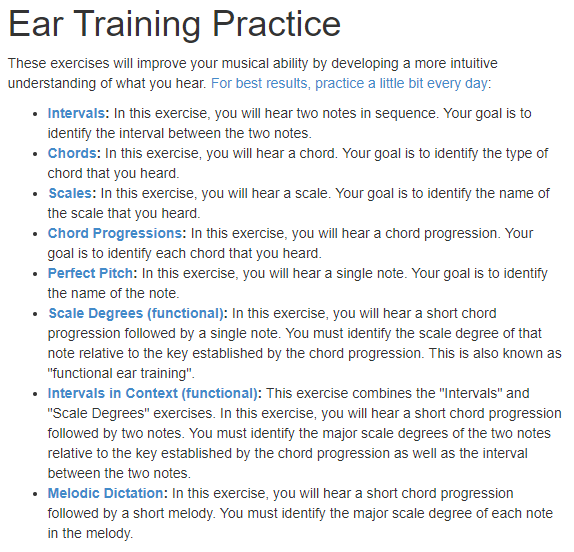

========================================
Music音乐
========================================

General乐理
----------------

视唱练耳:
`Ear training - tonedear.com - exercises <https://tonedear.com/>`_

Guitar吉他
----------------

`RockSmith <https://www.gamesrocket.com/rocksmith-2014-pc-mac.html/>`_

    网友分享

    (1) 吉他:最好用电吉他，喜欢原声吉他的话建议加装个拾音器，入门级的就可以了,预算足的话就一步到位买把喜欢的免得以后换。

    (2) 原版线：这个线类似于一个USB声卡，那么如果你手边有带USB声卡功能的效果器(我用的是Zoom G2.1u)或者USB声卡(Behringer U-PHORIA UM2),建议事先测试下这些设备是否能够玩rock smith。 我的电脑是windows 10 home版的系统，测试下来前者可以使用毫无问题，后者好像驱动有问题根本玩不了。如果使用板载声卡玩rock smith的话延迟可能比较厉害，因为是玩游戏加练习吉他，那么延迟会造成你弹奏的节拍和软件接收到的的不一致（软件反应出的弹奏晚一些），从而严重影响你的练习。可以先测试下你的板载声卡够不够强悍，如果太差而你有没有别的声卡，那么你就需要考虑买一个原版线。

    (3)电脑：这个游戏对电脑配置要求很低，推荐配置如下，很古老的配置了，现在随便个办公笔记本都有这个配置。建议不要用MAC玩，歌曲文件资源比较少。还是那句话，土豪随意。

    (4)软件：

    4.1)注册steam会员，安装steam，在steam中在线购买并安装rocksmith 2014 remastered，118大洋可以支付宝。6.2G的安装包，下载需要大概50分钟.

    4.2)注册customsforge会员，目的是为以后玩自制CDLC(网友自制的练习曲目)，当然土豪直接从steam官网上买歌也行。

    4.2.1）steam里买个the smashing pumpkins 乐队的 cherub rock，12大洋，可支付宝。这个是必须的，否则CDLC下载了识别不出来。

    4.2.2）下载D3DX9_42.dll,放到C:\Program Files (x86)\Steam\steamapps\common\Rocksmith2014目录，这个是CDLC运行的一个必须的文件，从customsforge里下的支持最新的Rocksmith2014。

    4.2.3）去ignition.customsforge.com找自己喜欢的歌(文件名_p.psarc)下好后丢到C:\Program Files (x86)\Steam\steamapps\common\Rocksmith2014\dlc下面，然后就可以玩了。

    备注：需要梯子因为很多下载的内容都是google drive或者dropbox。国内资源在bbs.3dmgame.com里有很多。

`叶湘伦的吉他手乐理杂货铺: <https://zhuanlan.zhihu.com/ylzhp>`_
`吉他手必备五线谱全攻略  <https://zhuanlan.zhihu.com/p/129873240>`_