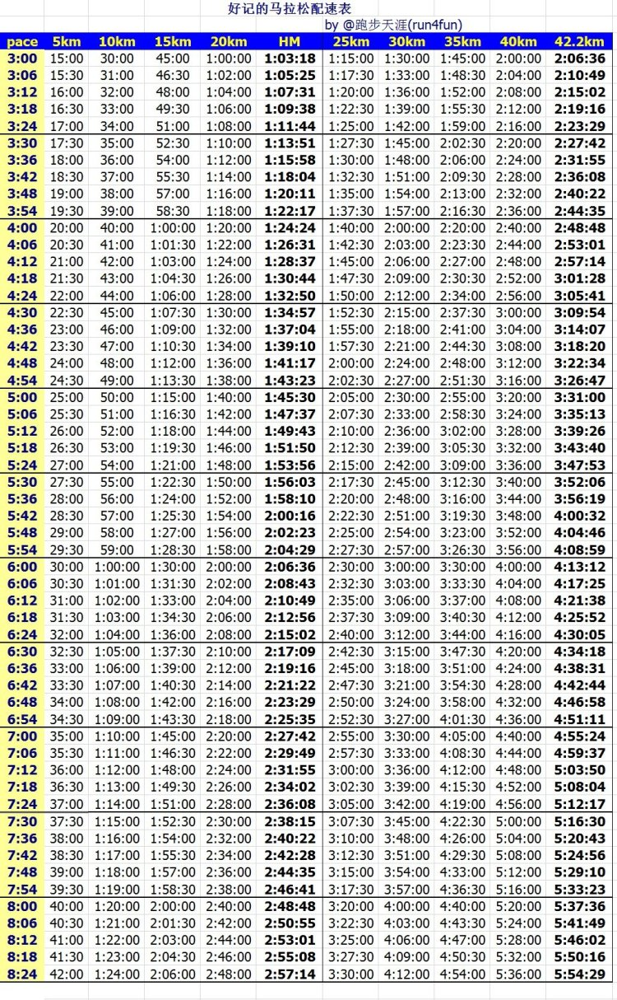

========================================
Run跑步
========================================

**配速表**
---------------

**心率**
---------------

`跑步心率         <https://www.jianshu.com/p/40859f68bd83>`_

`跑步训练的心率区间 <https://www.jianshu.com/p/5a72acd3ec92>`_

    自美国国家心脏、肺和血液研究所(NHLBI)，这里有一个科学且严谨的计算公式来自于他们的一篇研究报告可以计算出你的最大心率：

    211 – ( 0.64 x 年龄 )

    各位可以算算自己的最大心率是多少。

    除了最大心率(Maximum Heart rate)，你还需要注意的是你的心率储备(heart rate reserve or HRR)。该概念是由Karvonen(1957)发展出来，它有别于最大心率(Maximum heart rate)和静态心率(resting heart rate)。

    心率储备(HRR) =  最大心率(Max) – 静态心率(Resting)

    那么，所谓的最大心率的80%是不是就是用上面这个公式算出的心率乘以80%呢？非也！这种所谓的最大心率的百分之多少称之为目标心率，它有一套公式来计算，目前使用得比较多的计算方法是Karvonen法：

    目标心率 = 心率储备(HRR) x 目标强度 + 静态心率

`心率区间代表什么 <https://upload-images.jianshu.io/upload_images/9564099-e77edc8d1bd7c26f.png>`_

