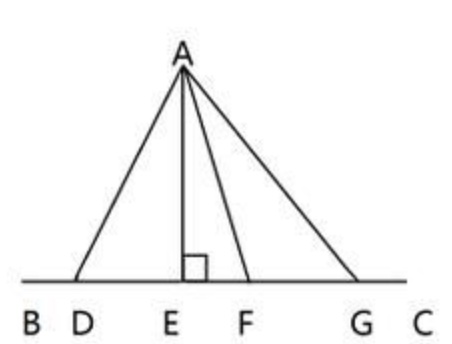
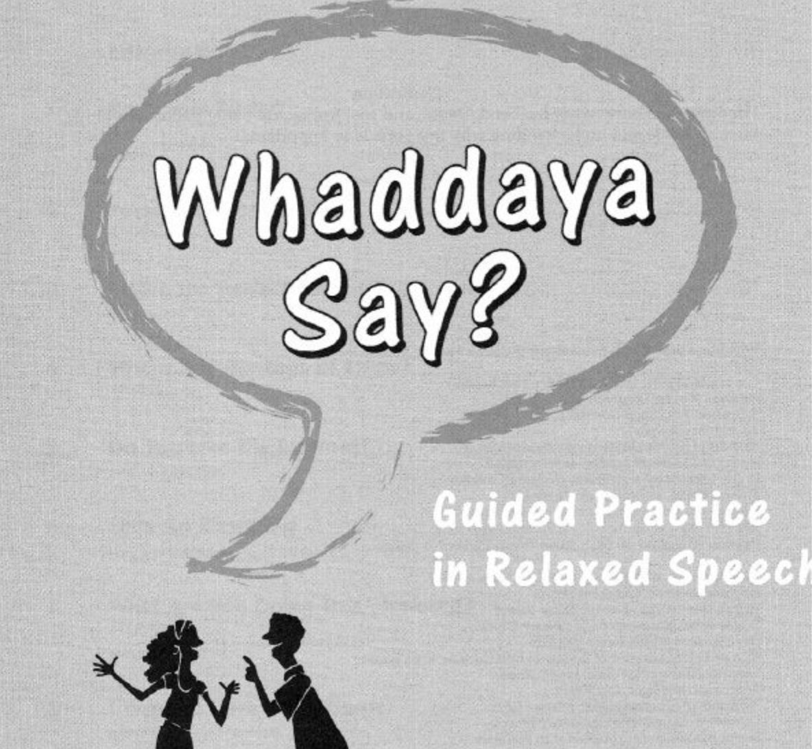
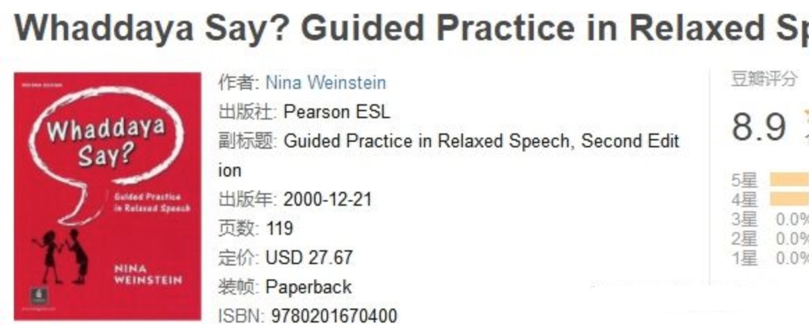
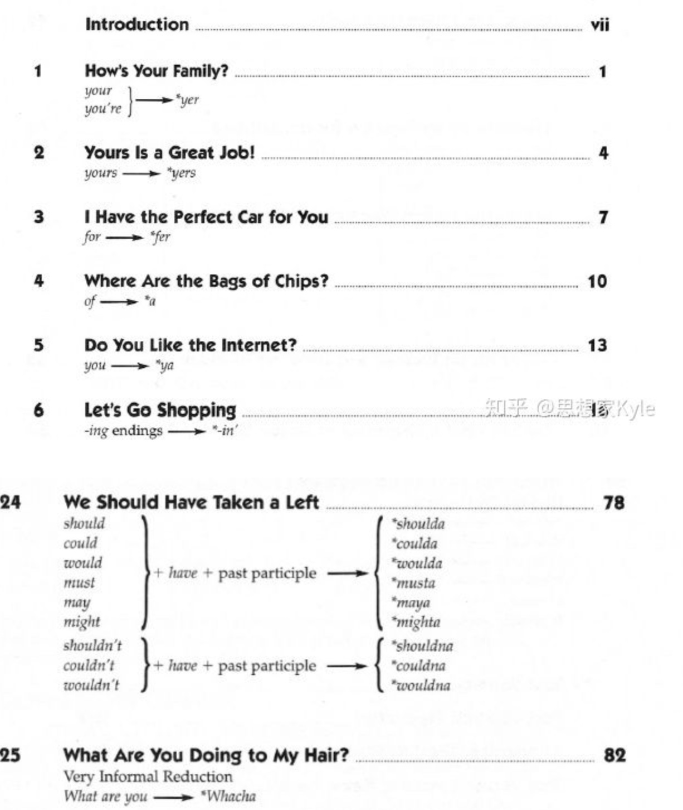

========================================
english英语
========================================

QuickLink
------------------

`Jason杰森锅教程: <https://space.bilibili.com/47740818/#/video>`_
`发音教程介绍 <https://mp.weixin.qq.com/s/9hneKMUn3QG1lC5Q0cT1ow>`_
`Aboboo <https://www.aboboo.com/docs/>`_
`EnglishPod(对话+主持人讲解文本 <https://www.aboboo.com/packages/package/2538/all/>`_

听力
------------------

`不出国如何练就一口流利的英语？ <https://www.zhihu.com/question/22968875/answer/454844693>`_

首先要打破
**一个常见的思维误区：国外待一年半载，英语就能学地呱呱叫？**

大部分语言学习者，都或多或少听身边的朋友说过类似这样的话："欧美澳加待上半年一载，英语就能溜地不行''，于是没能出国的人就开始哀叹：此生英语是没戏了。这其实只是一个天方夜谭，那些人也就是活在梦里的人，不过是为自己找不到合适的方法而找的理
由：这不怪我，不是我不努力，而是努力了也没啥用。去一趟美国就发现存在大量不懂英语的华人，或者是只能日常简单交流下。

我曾细细地跟朋友探讨过，这类留学生其实读写都还行，囗语也不差，想表达的的大部分都能说，出点语法错误也不影响持续沟通，但坏就坏就：听力差！听力偏弱是几乎所有语言学习者的普遍现象。
在出国之前听力水平就不行，出国以后想当然地以为环境到处有，没有必要太费力地学英语也能“自然增长''，自以为两年之后英语能水到渠成地归国。
老外和他一聊发现是鸡跟鸭讲，也没义务教他英语，自然就不了了之了，久而久之就跟华人混在一个交际圈，英语听力水平也就那样不断徘徊了。

**解决听力问题，几乎是学好英语的第一步！只有听得懂，说的英语才有意义**

**〖i+1〗材料的选择**

    美国南加州大学StephenD.Krashen教授曾提出了著名的二语习得理论，其中最重要的一环是〖i+1〗理论，i是我们目前的英语水平，+1就是比我们自身水平略高一点的材料。

    也就是我们输入的内容，必须是比自身水平略高一点点的材料，才是真正高效的可理解输入。

    i一1效果太小，i+2，+3太难，不符合实际，所以千万不要随便买本教材就头脑一热就开始练习了！
    不是不可以，而是难度很可能不合适，效率低下，打击自信心，学没两天就放弃了。

* **精听**

    1、盲听
    如果是视频的话，就屏蔽掉中文字幕（资源有方法），盲听3遍以上

    （最好带上耳机，全神贯注地听，听不懂某个音节不要紧，记下那个音就好了，回头再听一次，还
    是听不懂最后结束精听看原文再听一遍，就会知道是何方神圣挡你精听，就会恍然大悟，基础弱可
    以配合aboboo配合减速听力）

    2、对比原文，查录生词，把生词收录进在线的单词册（比如有道）

    （这一步非常重要，听了三四次的拦路虎终于被收紧笼子里了，发音和拼写总该记住了吧）

    3、关掉文本，再盲听两次

    这时候听就会有恍然大悟的感觉，基本都能听懂，还是没听懂的就要注意了，这就是难点，也是最
    需要提升的点。看看究竟是什么原因没听懂，弱读还是连读，语速太快还是．“

    4、打开文本（视频），开着音频，对着节奏读两遍

    这时候重在积累，属于囗语模块，算是彻底掌握了这篇文章，当初没听懂的地方多念两遍，把自己
    死里搞。

* **泛听**

    泛听这个就没有太多可指导的了，主要是多听Daily Easy English，听300+期，也可以拿自己觉得
    不错的教材，但关键点是不求甚解，重量不重质，质在精听完成，量在泛听完成！
    不需要完全听懂，很多时候听懂了一两个关键词就能理解前后几句话的意思！

**精泛结合，打通任督二脉**

    * 用于精听的教材：走遍美国

    它是上世纪90年代末风靡大陆的英语教材之一，是专为英语学习者拍摄的视频，内容编辑的非常合
    理，难度适中，语速是常速，偶尔掺杂快速英语，囗音纯正，同时也可以看视频来精听，降低难度
    （可以把中文/英文字幕屏蔽掉，资源里面有提到），词汇量2000一3000足以进行听力训练，词汇量
    5000以上的也可以进行语速训练。缺点就是视频的分辨率一般，不过还行，可以观看，不要电脑全
    屏就还好。

    * 用于辅助精听的工具：Aboboo软件

    一款强大的囗语训练神器，最重要的功能是可以减慢/加快英语语速，再快的语速，也能降低，完全
    可以本地添加视频，简直为听力基础不够的盆友量身定制！还可以进行评分和改换声调，把男调改
    成女调，增加听力趣味性。可以直接百度搜索下载软件！

    * 用于泛听的教材：DailyEasyEnglish

    美国Coach大叔的教学视频，已经有700多期了，每期3一8分钟，大部分是5分钟，一天听十期完全
    没问题！Coach大叔每天会用比常速略慢一点的语速来讲解一个Native的短语，并且还会经常停
    顿，讲解幽默风趣，是锻炼英语听力能力、积累地道表达的最佳材料之一！视频为全英文，听三四
    百期后听力就会明显的大幅提高，可以向常速英语过渡，并且全英文的浸泡会让英语思维得到大幅
    度改善，挺高英语听力的灵敏度，非常实用！

    * 专为囗语推荐的：有道囗语大师

    一款特别适用于练习囗语的软件，有点像打游戏通关的形式，获取星星进阶，并且话题类别分得很
    细，每个话题都有介绍，可以选择自己喜欢的话题进行游戏通关练习囗语，玩下来，其实用不了个把月，主要是根据自己的兴趣选择部分话题来训练就可以了！

    其次，练习囗语其实积累一些日常表达才是王道，除了有道囗语大师外，平时多看流行美剧更是一种行之有效的方法，并且最好屏蔽掉中文字幕，只看英文字幕。
    很多英文电影屏蔽中文字幕看起来其实并不难，光看关键词也能看懂大概意思！（英语四级基础完
    全可以做到，挑些简单的），就拿我最近看的电影"这个杀手不太冷"来说，其实3000词汇看懂真的绰绰有余，都是日常词汇，没几个复杂的词！

    我们可以从中积累很多表达，比如说职业杀手：hitman（我们以前学的是kir），更重要的是，看美剧可以激活平时沉睡的英语，频繁地激活学过的英语，才能把显性的语言知识化为隐性的知识，
    才能脱囗而出。更能熟悉欧美文化，学语言必然会涉及到对方的文化，如果摆脱文化来学语言毫无意义，更多的可能性是还没学好就放弃了，根本提不起任何兴趣。我认识的很多中文好的外国朋友，全都是对中国
    很感兴趣，想环游中国的！

口语视频
------------------

`[阿曾]我是怎样学英语的  <https://www.bilibili.com/video/BV1Db411V721>`_
------> `[阿曾曾儿]个人空间  <https://space.bilibili.com/30145454>`_

`最好的口语练习方法，没有之一！  <https://www.bilibili.com/video/BV1GE411K7fk>`_

`一个人alone怎么样有效练习英语口语  <https://www.bilibili.com/video/BV1BE41197ib>`_

口语练习
------------------

`看美剧练英语口语：3种影子跟读法+6步详细步骤  <https://www.bilibili.com/video/BV18J41137y6>`_

`影子跟读使用法 Shadowing Step by Step  <https://www.bilibili.com/video/av66981874>`_

**影子练习法**

    学习语言其实就是一个不断“模防'的过程。学习者需要把自己当做那个语言的公民，去了解他们的思维方式，文化和习俗，用
    他们的方式去思考问题。同传课上老师教授的影子训练法就为我提供了不断模仿和训练的机会，让
    我在短时间内提高自己的听力和囗语。
    影子训练法指的是你同时或慢半拍，根据听到的声音做实时的模仿（包括所有语音语调），整个过
    程你就像是演讲者的影子一样。影子法将外语的三个要素，即"听“，“说“，“读“完美的结合在一
    起，练习影子法，可以同时提高听力，阅读，囗语能力。
    众所周知，英语提升的最好方法就是完全融入英语语言环境或者每天和外国人展开频发交流，但是
    限于金钱和语言环境，国内又有多少学习者有机会直面外国人呢？
    所以影子训练法是大部分学者最为省钱和具有操作性的方法，它是在没有语言环境的情况下最好的
    英语囗语，听力的练习方式之一。此方法不需要借助任何人的介入，一个人就可以在安静的环境里
    面进行。
    影子训练法需要的设备也很简单，可以说是省钱省时间，比动则上万的机构培训费性价比高了不
    少。练习影子法，你基本上只需要一个放音设一，一只箬。如果要把这种法做到
    极致，那你还要准备相关语音材料的中英对照稿。（网络上很容易下到语音材料的中英对照稿）

**口语发音**
------------------

我们先谈一谈什么是囗音，根据比较科学的解释：
**不考虑音质的话，囗音=发音+语调；**
而发音主要分为两个模块，第一个是元音、辅音和混合音的发音；第二个是语流规则，比如连读，弱读。
很多童鞋觉得自己囗音太差，所以不敢开囗说英语，其实是对囗音有点理解上的误差

拿美国为例，老美的语调和语流规则是基本相同的，但发音上却不尽相同，因为不管是南北各州还
是东西海岸哪个地方，都存在地区性发音差别。就像我们各省的囗音一样，我们广东仔很多人舌音就发不准，我也是成年以后才跟外省的朋友慢
慢纠正回来，北方特有的儿化音就更加不用说了。

我们真正需要做的是掌握常见的语流规律，以及音标发音到位（主要是纠正薄弱的少数音），剩下的语调反而不急，慢慢在听力材料中模仿。

**材料推荐：**

1. 《The American Accent Course》（大众级别）

    这部发音教材比较专业，从元音、辅音、混合音、节奏和语调，以及发音技巧全都有了，非常详尽，重点是有中英文字幕两个版本

    视频结束会有句子操练，一定要大声跟读，而且时间长短控制的非常好，Lisa本人也是语言教学背景出身，视频质量比较高。

    .. image:: pic/200329_englishOral.jpg

2. Coach 系列

    Coach是个美国大叔，油管博主，YouTube上关注人数不算多，但是他的视频是流传甚广，比较有名的是Daily Easy English，Daily English Dictation，以及Daily Dictation Members。

    这三个视频都是着重讲听写，顺带讲发音，图上很多圈圈叉叉的地方就是coach划出的发音重点。

    如果说所有发音视频里面，哪个最有趣，无疑是coach的，不会特意的拎出音标来讲，在泛听的同时还能练语流规则，可谓一举两得，coach会不断地重复发音重点。

    PS：如果仅仅是练习发音的话，可以快进式学习，快进到讲发音的部分

    .. image:: pic/200329_englishOral2.jpg

3. Pronunciation workshop

    Pronunciation workshop 是由Paul主讲的视频教程，Paul本人会用慢速英语来讲解老大难部分的薄弱音标，且频繁停顿，做出比较夸张的嘴型

    视频只有16期，每期10分钟，
    **非常合适用来突破老大难的少数几个发音**，比如/r/和/w/, /s/和/z/, /f/和/v/和/th/的发音。Å

    .. image:: pic/200329_englishOral3.jpg

**连读弱读**
------------------

`在英语学习过程中，有哪些书籍让你醍醐灌顶？ <https://www.zhihu.com/question/26483956/answer/501698331>`_

海外工程师一枚，回顾整个英语学习过程，有1本书曾让我的英语囗语、听力水平突飞猛进。可以极大程度地改善人的囗语发音、听力辨识能力，重点是非常非常适合训练！
它是典型的学生教材，更是自学教材，完全可以无师自通。

**推荐理由：**

    Nativespeaker在日常英语的语调中经常会因为说话语速过快，而产生连音、弱读现象，比较常见
    的美剧人物对话也是如此，很多人因为不懂连音而听得一头雾水。

    而这本英语原版的发音书可以极其有效简单粗暴地告诉你所有常见的连读、缩读、弱化，这点真的
    是暴虐了99％的发音规则书！

    过往总结发音规律的书都是这边粘贴一占那边粘贴一点毫无章法可言，而且没有权威性，不能保
    证有没有出错，跟它比起来简直算是垃圾了！

    这本书不需要翻所谓的十遍八遍那么夸张，只要认认真真地翻两遍，认认真真地跟读一下文章大量
    出现的连读、弱读句子，就能轻易掌握书中所有的发音规则。不要问为什么，原因很简单，一般的发音规则书一个知识点只会举一两个例子，这本书会举近10个
    例子，并且每章每节都有连贯性。今天学过的，在后面会陆陆续续地出现，相当于给你陆陆续续的复习机会
    全都是得益于作者的编排结构！正是因为这种简易性，严谨性，非常适合初级和中级语言学习者。

    这个原版教材的精华部分就是这左右两个内容相同的小短文。
    左边短文会以慢速英语，不连读，不弱读，不缩读来朗读一遍；
    然后接着右边短文会以快速英语，带连读，缩读，弱读地朗读一遍！

**学习建议：**

    **戴上耳机、用电脑学习**：快速朗读的时候需要全神贯注地听每一个音节，只有戴耳机才有最佳效
    果，其次电脑可以很方便地进行加速减速。

    **先难后易**：原理很简单，有些语音规则都是会的，自然不需要一开始就学那些，应该从重点的、
    不会的先开始，才是最有效的！

    **隔天复习**：人的遗忘性大家都懂，也不需要你复习十遍百遍，复习两三遍绰绰有余了

    **必须跟读**：一直在听只能转换成听力词汇，没法应用到囗语上，一说英语马上打回原形了、那么
    好的材料，为什么不好好朗读几遍呢？

    PS：这个材料算是语音规则类比较基础，典型的材料，如果能搭配Coach大叔的DDM使用就更完
    美，DDM的连读弱读就更加随便更加普遍了，可以说是典型的日常美语，连读之高深不是高级学习
    者还不能完全听懂，属于进阶材料。