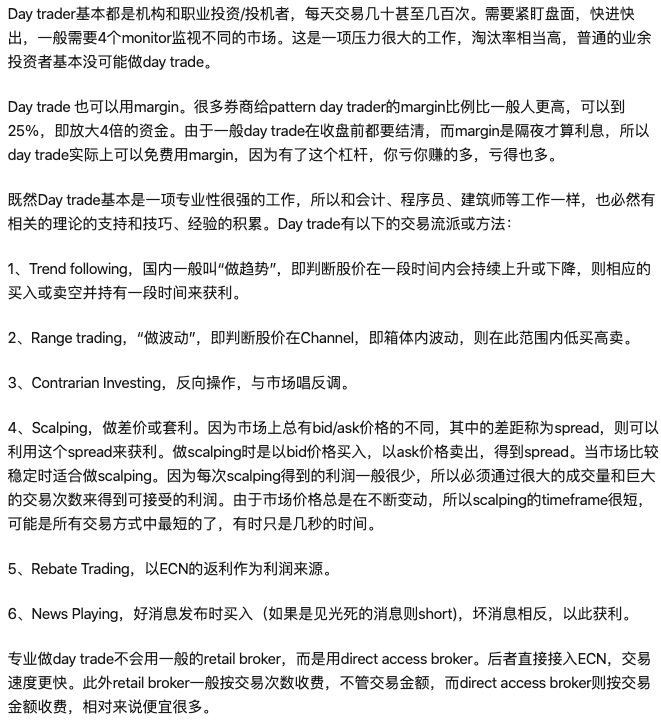

========================================
Data交易数据
========================================

内盘期货
-----------------
中国金融期货交易所 `合约规格 <http://www.cffex.com.cn/jscs/>`_

上海国际能源交易中心 `合约规格 <http://www.ine.cn/bourseService/summary/?name=tradingdaily>`_

上海期货交易所 `合约规格 <http://www.shfe.com.cn/bourseService/businessdata/summaryinquiry/>`_

大连商品交易所 `合约规格 <http://www.dce.com.cn/dalianshangpin/yw/fw/ywcs/jycs/rjycs/index.html>`_

郑州商品交易所 `合约规格 <http://www.czce.com.cn/cn/jysj/jscs/H770303index_1.htm>`_

上海黄金交易所 `合约规格 <https://www.sge.com.cn/sjzx/yshqbg>`_

内盘证券
-----------------

上海证券交易所 `上证 <http://www.sse.com.cn/>`_

深圳证券交易所 `深证 <http://www.szse.cn/>`_

全国中小企业股份转让系统 `新三板 <http://www.neeq.com.cn/>`_

外盘期货
-----------------

`合约规格   <https://www.ftigers.com/trade_exchange_sgx.html?exchange=1#sgx1>`_
`限价熔断   <https://www.ftigers.com/trade_exchange_cme_fusing.html#fusing2>`_
`保证金     <https://www.ftigers.com/trade_exchange_money.html#money1>`_
`佣金      <https://www.ftigers.com/help_charge.html?chargeL=1>`_
`订单      <https://www.ftigers.com/help_trade.html#trade3>`_
`TWS教程   <https://www.ftigers.com/download_ib_help.html?tws=help>`_

Note: 老虎期货账户默认支持期货/期货期权/股票期权, 通过IB账户管理可以进行查看

外盘证券
-----------------

`美股百科   <https://baike.baidu.com/item/美股>`_

美股交易时间：

===============  ==================  ==================  ==================
工作日                盘中                 盘前                   盘后
===============  ==================  ==================  ==================
交易所时间         04：00 - 09：30      09：30 - 16：00     16：00 - 20：00
北京时间（夏）      21：30 — 04：00     16：00 — 21：30      04：00 - 08：00
北京时间（冬）      22：30 - 05：00     17：00 — 22：30      05：00 - 09：00
===============  ==================  ==================  ==================

美股T+0限制

    是由美国证监会SEC制定的PDT(Pattern Day Trader)限制：

    * 资产在25000美元以下，连续5天T+0次数不能超过3次，否则会被禁止交易90天, 直到保证金账户（包括现金、股票和其他合规资产）资产补足到25,000美元

    * 资产在25000美元以上，T+0次数没有限制，可以做日内交易PDT。

美股可以做T+0日内交易?

    前提是你得有一个保证金账户，现金账户是无法做T+0的。

    先说结论：

    #. Cash现金账户，只能 T+3
    #. Margin融资账户+账户总值在 $2,000-$25,000 ---> T+1（5个交易日内最多3次T+0）
    #. DayTrading融资账户+账户总值在 $25,000 以上 ---> T+0
       T+0 时，「使用到当日冲销购买力」的金额需要在当日还清

    普通美股现金账户是股票T+0，清算T+2，资金T+3。什么意思呢？就是假如你原本持有某支股票100 股，10 美元/股抛售后，账户里的股票是当日交割的，但这1000 美元资金必须要到3天后才能使用。因此，现金账户是无法实现T+0的。

    国内的富途、积木都只能开设现金账户，老虎证券支持保证金账户。

    `美股日内交易FAQ <http://blog.sina.com.cn/s/blog_acec0d7f0102wnep.html>`_
    `无限次T+0的券商 <https://www.mg21.com/dt>`_

    美股T+0日内交易次数举例说明：

    (1)此前空仓状态,同一支股票,当天分两次先操作买入200,再买入300股,然后当天稍后时间,分三次分别卖出100,200,200;这样算几次 T+0 ?　　
    答案：1次

    (2)此前空仓状态,同一支股票,当天买入200,稍后卖出200,过了一会又买入300,再卖出300,这样一共算几次 T+0 ?　　
    答案：2次

    (3)此前空仓状态,同一支股票,一次性买入500股,当天分3次卖出,算几次 T+0 ?　　
    答案：1次

    (4)此前空仓状态,同一支股票,当天分三次分别买入100,200,300股,当天稍后,一次性卖出600股,算几次 T+0 ?　　
    答案：1次

    (5)此前空仓状态,同一支股票,周一当天买入500股,周二当天买入500股,周二稍晚些时候卖出500股,算几次 T+0 ?　　
    答案：1次

    (6)此前空仓状态,同一支股票,周一当天买入500股,周二当天卖出500股,周二稍晚些时候买入500股,算几次 T+0 ?　　
    答案：0次

关于DayTrader：

    `一个职业Day Trader的感受  <http://www.numgame.com/c_day_trader.html>`_
    `为什么我不做day trade和 短线  <http://8ok.com/bbs/200905/tzlc/3891.shtml>`_

VIX
-----------------

VIX由S&P500 （标准普尔500指数）的成分股的期权波动性组成，且被广泛用来作为衡量市场风险和投资者恐慌度的指标。

该类指数有三种：

* VIX 跟踪S&P500         (Volatility Index S&P500  )
* VXN跟踪Nasdaq 100成分股 (Volatility Index Nasdaq  )
* VXD则跟踪道琼斯工业指数   (Volatility Index DowJones)

    1993 年，芝加哥期权期货交易所 开始使用第一支VIX，仅仅从S&P100 里选出8只股票来做基础。
    10年后，此范围扩大到S&P500。从而可以获得更大的准确性。

    VIX指数（CBOT Volatility Index），即波动率指数，是由CBOT所编制，以S&P500指数期权的隐含波动率计算得来。
    若隐含波动率高，则VIX指数也越高。该指数反映出投资者愿意付出多少成本去对冲投资风险。
    因此，VIX广泛用于反映投资者对后市的恐慌程度，又称“恐慌指数”。
    指数愈高，意味着投资者对股市状况感到不安；指数愈低，表示股票指数变动将趋缓。

    参考指标通常有：^VIX ^VIF ^VIN VIX.HA V IX NZ

沙场轶事
-----------------

`庄股好教材 <http://finance.sina.com.cn/stock/relnews/cn/2020-04-03/doc-iimxxsth3390537.shtml>`_