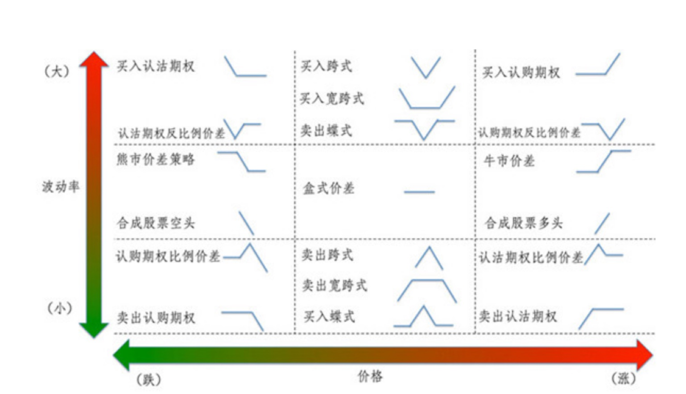
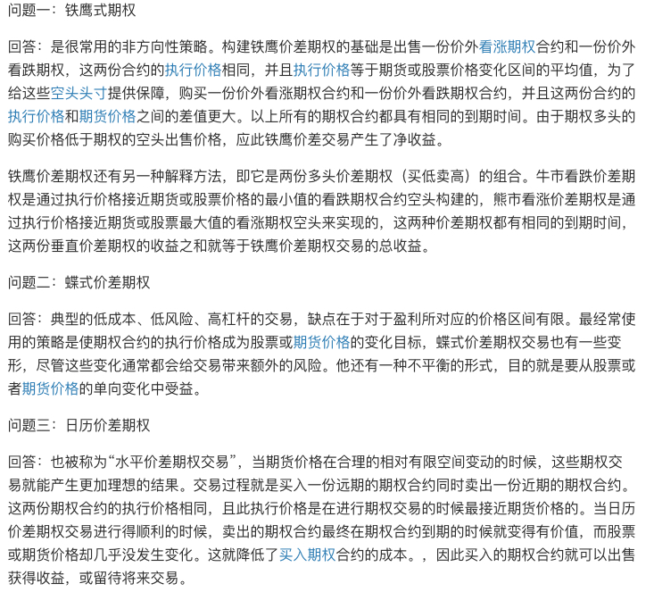
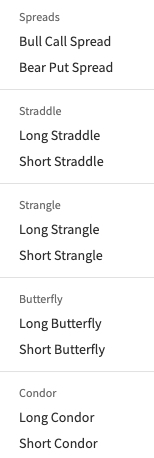
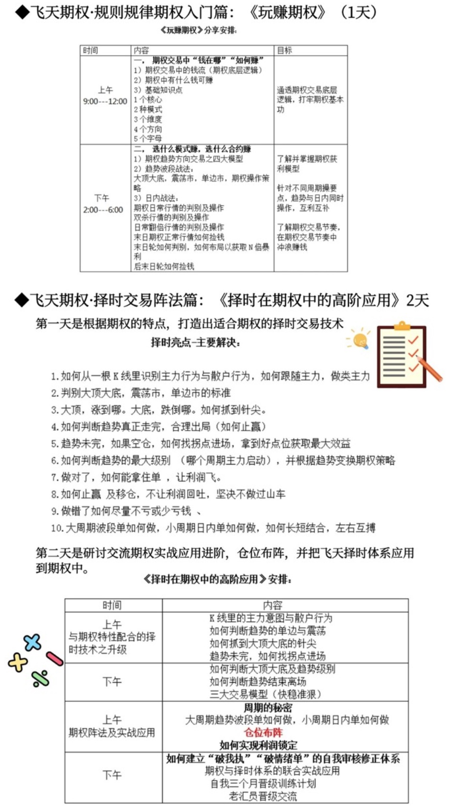

========================================
Option期权
========================================

期权策略
-----------------

`期权组合策略 <http://www.360doc.com/content/15/0209/03/21371159_447358106.shtml>`_
`策略构造online <http://optioncreator.com/>`_
`CBOE期权策略 <https://www.cboe.com/strategies>`_

`六大策略玩转期权市场 <http://finance.sina.com.cn/option/knowledge/2019-04-24/doc-ihvhiewr7906850.shtml>`_

=================   ==================================
bull call spread    long + short | call
bear put spread     long + short | put

long straddle       long  | call + put
long strangle       long  | call + put
short straddle      short | call + put
short strangle      short | call + put

long  bufferfly     long + short | bull call spread
long  Condor        long + short | bull call spread

short bufferfly     bull call spread + bear put spread
short Condor        bull call spread + bear put spread
=================   ==================================

中级期权策略

long  bufferfly买入蝶式套利

.. image:: https://xqimg.imedao.com/15db6ea1c96ecac3fdc37801.jpg!custom660.jpg

Long Condor 买入铁鹰式

.. image:: https://xqimg.imedao.com/15db6ea1c9fecad3fd153519.jpg!custom660.jpg

short bufferfly卖出式套利

.. image:: https://xqimg.imedao.com/15db6ea1ce1ef0c3fe6dec70.jpg!custom660.jpg

Short Condor 卖出铁鹰式

.. image:: https://xqimg.imedao.com/15db6ea1c82ecab3fc9e48bf.jpg!custom660.jpg

`期权策略应用场景 <https://xueqiu.com/5334398458/90110262>`_

.. image:: https://xqimg.imedao.com/15db6ea1aecebb03fe5679ff.jpg!custom660.jpg
.. image:: https://xqimg.imedao.com/15db6ea1ae3ed073fd3fbc3d.jpg!custom660.jpg

期权高级策略
----------------------------

`期权高级策略案例学习大纲 <https://mp.weixin.qq.com/s/lB1Sf6xfipZY1F3JGFdaAw>`_

Part1  Option Pricing 期权定价

    1.1 欧式期权（European Options）定价以及模型背后的原理

    1.2 美式期权（American Options）定价以及模型背后的原理

Part2  基本策略积木

    2.1 买入认购（Long Call）

    2.2 买入认沽（Long Put）

    2.3 卖出认购（Short Call）

    2.4 卖出认沽（Short Put）

Part3  Option Spread 期权价差策略

    3.1  垂直价差与水平价差 Vertical Spreads & Time Spreads

    3.2  比例价差策略 Options Ratio Spreads

    3.3  跨式与宽跨式 Straddle & Straggle

    3.4  收益增强策略 Yield Enhancement：Covered Call & Covered Put

    3.5  保护策略与领口 Protective Puts & Collar

    3.6  期权Delta中性策略Delta Neutral Trading

    3.7  事件驱动交易 Event-Driven Trading

    3.8  合成头寸策略  Synthetic Positions

    3.9  转换套利与反转套利  Conversion & Reversal

Part4  Volatility 波动率

    4.1  隐含波动率（Implied Volatility）计算方式

    4.2  波动率倾斜（Volatility Skew）和标准化的波动率矩阵

    4.3  远期波动率（Forward volatility）公式计算方法和简便计算方法

    4.4  波动率套利（Volatility Arbitrage）原理和案例解析

    4.5  交易VIX

Part5  Greeks希腊字母深度剖析

    5.1  Delta和到期日的Delta陷阱

    5.2  Shadow Gamma和到期周Gamma的威力

    5.3  Theta和时间价值的陷阱

    5.4  Scaled Vega的巧妙运用

    5.5  Greeks盈亏分解：到底是Vega还是Theta赚的钱

    5.6  Lambda与期权的杠杆

    5.7  Vega的高阶：Volga/Vomma

    5.8  Delta的高阶：Vanna/Charm

Part6  Hedging对冲

    6.1   Hedging Methods 对冲方法

        6.1.1 Hedging at Regular Intervals 固定时间对冲

        6.1.2 Hedging to a Delta Band Delta阈值对冲

        6.1.3 Hedging Based on Underlying Price Changes 基础资产价格改变对冲

        6.1.4 Hedging Cases 对冲实战案例

        6.1.5 Dynamic Hedging 动态对冲

        6.1.6 Gamma scalping与 Gamma 对冲

    6.2  Hedging Simulation 对冲案例模拟

        6.2.1  Discrete Hedging and Path Dependency 离散对冲和路径依赖

        6.2.2  Volatility Dependency 波动率依赖

        6.2.3  到期周的Delta对冲技巧

飞天期权
-----------------

`[虎友访谈]玩期权应该注意些什么？ <https://www.laohu8.com/post/250958>`

飞天期权
-----------------

`飞天期权网课 <https://appEU0AcIPx2046.h5.xiaoeknow.com>`_

视频系列：
飞天期权基础知识系列（三套）
飞天·期权演义
飞天·期权秘籍
飞天期权每周二

线下系列：
《玩赚期权》
《择时在期权中的高阶应用》

